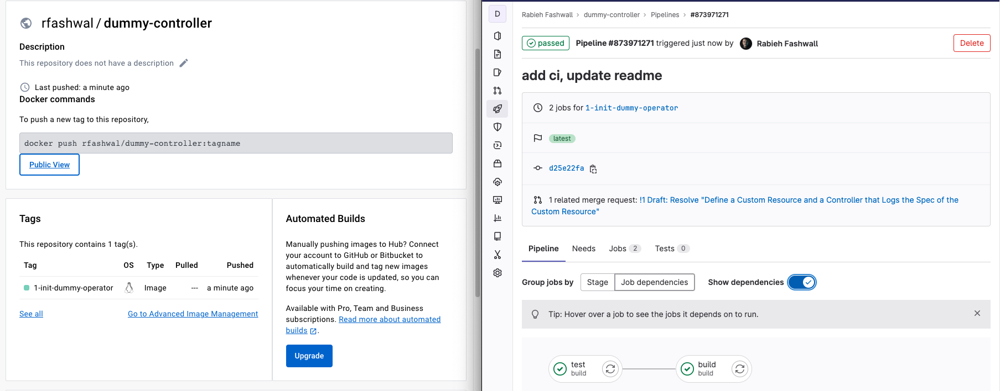

# dummy-controller

A small Kubernetes Custom Controller in Go.

## Define a Custom Resource and a Controller that Logs the Spec of the Custom Resource
### Initializing the Operator
using operator-sdk, execute the below command to init the custom controller
```
operator-sdk init --domain interview.com --repo gitlab.com/rfashwal/dummy-controller
```

### Create Dummy API
- execute the below command for api creation
```
operator-sdk create api --group=interview --version=v1alpha1 --kind=Dummy
```
- create the resource and the controller
```
Create Resource [y/n]
y
Create Controller [y/n]
y
```

### Generate controller and manifests

```
make manifests
make generate
```

### Customising Dummy Spec and update controller
Open the generated file api/v1alpha1/dummy_types.go and modify it to define the structure of the Dummy custom resource spec, update the controller logic accordingly.

### Deploying
A CI process will build the image and push it to the registry where it can be used to deploy the controller
Deploy the controller after the image is pushed:

```
 make deploy IMG=rfashwal/dummy-controller:1-init-dummy-operator
```



## Give Dummies a Status and Make the Custom Controller Write to it
Update the status of Dummy crd to include SpecEcho and follow the above steps to build and deploy

## Associate a Pod to each Dummy API object
- Update Dummy status to include podStatus
- Update controller to check for pod if not found, create the pod
- Update the dummy staus to include podStatus


# Testing

## Prerequisites

- initiate a Kubernetes cluster using kind or minikube
- kubectl command-line tool
- Docker
- Operator SDK

## Image registry
- The release images are found under: https://hub.docker.com/repository/docker/rfashwal/dummy-controller/tags?page=1&ordering=last_updated
For each step, a branch is created and image is released, so you can test any step independently. `latest` tag is the final working controller as specified.

## Local testing
- clone the repo: `git clone git@gitlab.com:rfashwal/dummy-controller.git`
- deploy with target image tag: `make deploy IMG=rfashwal/dummy-controller:{tag}`


